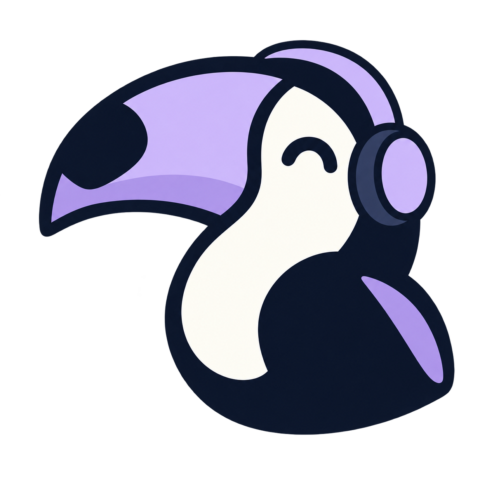
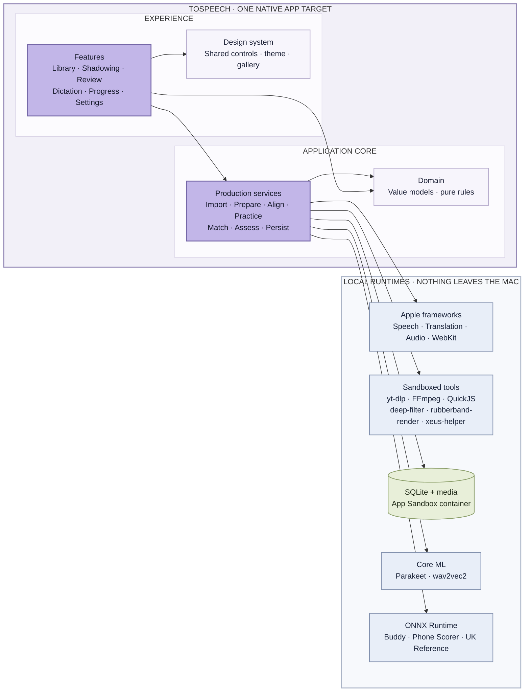
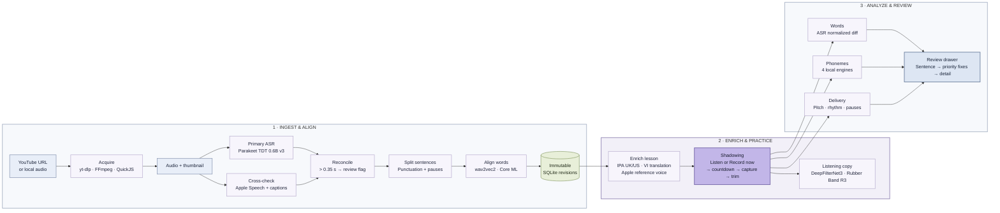

<p align="center">
  
</p>

<h1 align="center">ToSpeech</h1>

<p align="center">English shadowing practice with on-device ASR, forced alignment and phoneme-level feedback.</p>

<p align="center"><b>English</b> · <a href="README.vi.md">Tiếng Việt</a></p>

<p align="center"><sub>Source tree, app target and bundle id still use the codename <code>ToSpeech</code>.</sub></p>

---

Paste a YouTube link. ToSpeech downloads the audio, transcribes it, splits it into
sentences, aligns every word, looks up IPA and translates to Vietnamese. You listen,
shadow and record. The app compares what you said with the source, phoneme by phoneme,
and lays your pitch and rhythm next to the speaker's. No server, no API key, no audio
leaves the machine. macOS 26+, Apple Silicon.

## Architecture overview



One app target. `Domain` imports Foundation only. `Features` compose `DesignSystem`
controls and call `Services`; they never see SQL, file paths or SDK types. Every
model engine lives in its own actor, is pinned by checksum, and releases memory when
idle.

## Pipeline



## How each step works

**1. Getting the audio.** yt-dlp's onedir build, statically built FFmpeg and FFprobe,
and QuickJS for yt-dlp's JavaScript challenges run as subprocesses inside the App
Sandbox. Checksums are pinned in a lock file and verified at build time. Every import
job checkpoints into SQLite: quit mid-way and it resumes on relaunch; cancel and the
child processes die with it. Only audio and a thumbnail are kept.

**2. Transcription.** Parakeet TDT 0.6B v3 through FluidAudio (Core ML, INT8 encoder,
SentencePiece token timings merged at real word boundaries). YouTube caption timing is not trusted: rolling
auto-caption VTT was measured and found wrong. Apple SpeechAnalyzer (macOS 26,
on-device) and captions are used only as cross-checks: interior words may be corrected
within a narrow time window, and a disagreement above 0.35 s raises a review flag
instead of inventing a timestamp. All three sources are stored with the lesson for
auditing.

**3. Sentence segmentation.** Punctuation and pauses, with short fragments merged. A
sentence is never cut just for being long: a slow 20-second sentence without
punctuation stays one sentence.

**4. Per-word timing.** wav2vec2-base-960h converted to FP16 Core ML. Viterbi CTC with
explicit blank and repeated-character states; word boundaries are taken at space
emissions so final consonants are not clipped. Sequential windows under 30 s at 16 kHz
with overlapping context at the edges. Words with weak acoustic support, too far from
the ASR anchor, or with unknown written forms keep their ASR timing and are marked for
review. Every timing edit creates a new revision; nothing is overwritten.

**5. IPA, translation, reference voice.** An offline SQLite dictionary built from
Britfone 3.0.1 (British) and ipa-dict (American); a missing UK entry falls back to US
with a visible marker. Sentences are translated with the offline Apple Translation
framework. Reference voices are AVSpeechSynthesizer in the matching UK or US accent,
labelled as synthetic. Linking suggestions are derived from transcriptions, not
detected in the signal.

**6. Recording and playback.** An AVAudioEngine tap writes CAF; source audio stops
completely before the microphone opens. Takes are edge-trimmed by energy, internal
pauses intact, with a manifest so an interrupted save can be recovered. For listening,
DeepFilterNet3 v0.5.6 (Rust helper, tract runtime) denoises a disposable copy followed
by constant gain; the original used for scoring is untouched. Slow playback is Rubber Band 4.0.0's R3 engine, running as a separate
`rubberband-render` helper process that only exchanges raw PCM files with the app;
without the helper, playback falls back to AVAudioUnitTimePitch.

**7. Feedback.** Four layers, each labelled for what it is:

- *Words*: the same ASR engine runs on the take and normalized word sequences are
  compared. Text evidence, not a pronunciation score.
- *Phonemes*: four local engines, selected by the job's provenance and never swapped
  silently.
  - **Buddy English v1**: wav2vec2 mispronunciation detection (speechocean762), INT8
    ONNX; recognizes phonemes and compares them with each word's IPA inventory. 30 s
    per audio.
  - **Phone Scorer E16**: Whisper encoder plus an ordinal scorer in ONNX
    (Accentedness-Scoring-Challenge), US English only.
  - **UK Reference**: a frozen wav2vec2-xlsr-53-espeak-cv-ft encoder (ONNX) with four
    heads trained on the EUSTACE corpus (9 vowel categories, stress, focus, boundary),
    SwiftF0 pitch, Silero VAD and eSpeak-ng en-gb as dictionary-first G2P. It keeps the
    British vowel contrasts that Buddy collapses.
  - **PhoneticXeus** (experimental): the XEUS multilingual phoneme recognizer running
    in its own helper process (PyInstaller, JSON lines, about 4.6 GB when warm). Full
    CTC posteriors are stored, mapped through a versioned UK inventory, with a tiny RP
    contrast head (logistic regression on a mid layer, trained on macOS `say` UK vs US
    voices) for the BATH/LOT pairs the CTC head merges, and compared against the
    teacher's audio for the same sentence.
- *Delivery*: pitch, intensity, duration and pauses of the take beside the speaker's.
- *Sound coaching*: a 44-sound RP library with reference audio (Newcastle IPA Online,
  Salford).

Everything is labelled evidence, not a calibrated grade. Sounds a model does not cover
stay neutral, and uncertain sounds are never painted red.

**8. Dictation.** Listen to the whole sentence before typing, optional time limit,
normalized word comparison, history kept per revision.

## Models and technology

| Task | Model / library | Runtime |
| --- | --- | --- |
| Download | yt-dlp 2026.08.19, FFmpeg 9.0.1, QuickJS | sandboxed subprocesses |
| ASR | Parakeet TDT 0.6B v3 (FluidAudio 0.15.7) | Core ML |
| Cross-check ASR | Apple SpeechAnalyzer / SpeechTranscriber | macOS 26 on-device |
| Word alignment | facebook/wav2vec2-base-960h, FP16 | Core ML |
| IPA | Britfone 3.0.1, ipa-dict en_US | offline SQLite |
| Translation, voice | Apple Translation, AVSpeechSynthesizer | Apple frameworks |
| Denoise | DeepFilterNet3 v0.5.6 | Rust helper |
| Slow playback | Rubber Band 4.0.0 R3 | separate GPL helper process (`rubberband-render`) |
| Phonemes | Buddy English v1; Phone Scorer E16; XLSR-53 eSpeak + EUSTACE heads, SwiftF0, Silero VAD, eSpeak-ng | ONNX Runtime 1.24.2 |
| Phonemes (experimental) | changelinglab/PhoneticXeus + RP contrast head | helper process |
| App | SwiftUI, Swift 6 strict concurrency, AVAudioEngine, WebKit, SQLite | macOS 26, arm64 |

Every model is pinned by revision and checksum and verified before use, whether
downloaded in-app or staged at build time.

## Try it

```sh
scripts/toolchain/fetch-toolchain.sh      # yt-dlp, FFmpeg, QuickJS
bash scripts/alignment/prepare.sh          # wav2vec2 -> Core ML (needs uv)
bash scripts/audio/fetch-deepfilternet.sh  # DeepFilterNet3
make build && make run
```

Xcode 26+, Apple Silicon Mac. Phone Scorer, UK Reference and PhoneticXeus have their own
preparation scripts under `scripts/assessment/`. ASR and Buddy models are downloaded
in-app from Settings → Recording & models. `make test` runs the tests and
`make gen` regenerates the project from `project.yml`.

## Status and license

Work in progress. Automatic transcripts and timing can be wrong on connected speech,
names and hard audio; the offline IPA dictionary does not cover every word. Phoneme
feedback is experimental evidence; there is no calibrated overall, stress or intonation
score.

Built for education, self-study and research. ToSpeech's own source is licensed under the
[PolyForm Noncommercial License 1.0.0](LICENSE): free to use, study, modify and share
for non-commercial purposes; commercial use is not permitted. Dependencies, models
and the bundled yt-dlp distribution (GPLv3+) keep their own licenses, see
[THIRD_PARTY_NOTICES.md](THIRD_PARTY_NOTICES.md). Lesson content belongs to its owners;
import only what you have the right to use. ToSpeech is not affiliated with YouTube,
Apple, NVIDIA, Meta or the authors of its dependencies.
