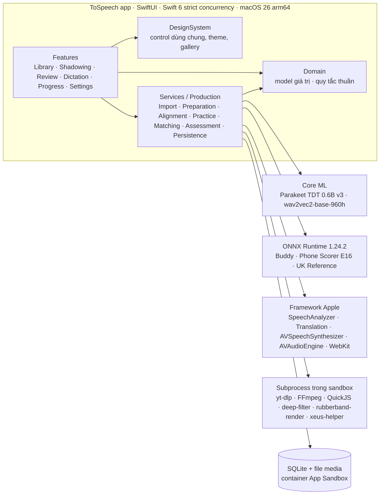
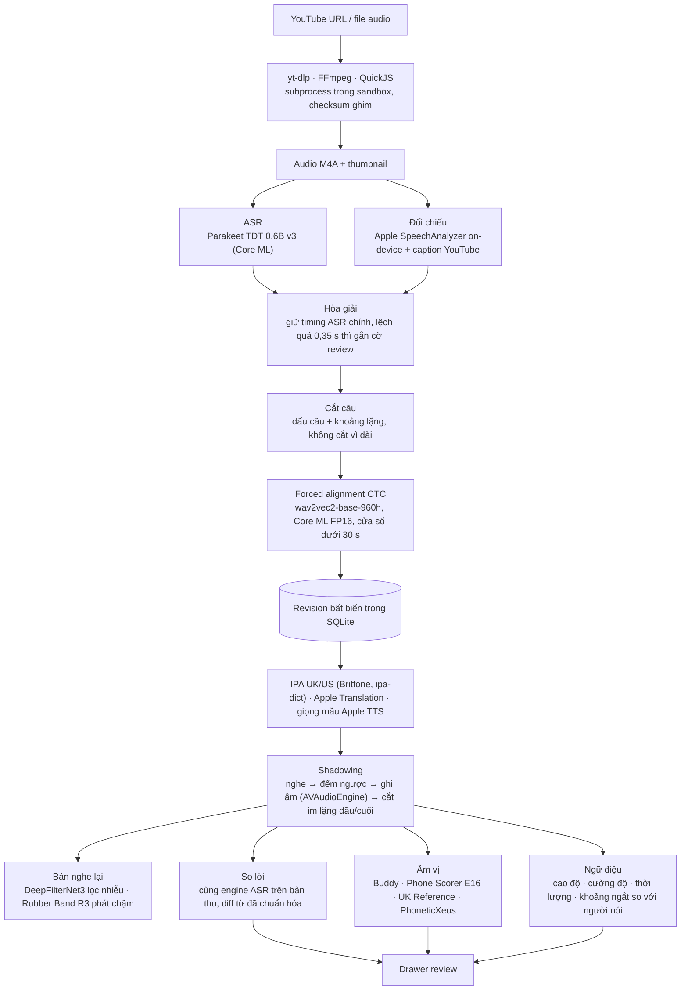

<p align="center">
  
</p>

<h1 align="center">ToSpeech</h1>

<p align="center">Luyện shadowing tiếng Anh với ASR, forced alignment và phản hồi âm vị chạy hoàn toàn trên Mac.</p>

<p align="center"><a href="README.md">English</a> · <b>Tiếng Việt</b></p>

<p align="center"><sub>Mã nguồn, target và bundle id vẫn dùng tên nội bộ <code>ToSpeech</code>.</sub></p>

---

Dán một link YouTube. ToSpeech tải audio, nhận dạng lời, cắt câu, căn timing từng từ,
tra IPA, dịch sang tiếng Việt. Bạn nghe, nhại theo, ghi âm. App so lời bạn nói với
lời gốc, so từng âm vị, so cao độ và nhịp với người nói. Không có server, không API
key, không gửi audio đi đâu. macOS 26+, Apple Silicon.

## Kiến trúc tổng quan



Một target app. `Domain` chỉ import Foundation. `Features` ghép control của
`DesignSystem` và gọi `Services`; không bao giờ thấy SQL, đường dẫn file hay kiểu của
SDK. Mỗi engine model nằm trong actor riêng, ghim checksum, giải phóng bộ nhớ khi rảnh.

## Pipeline



## Xử lý từng bước

**1. Lấy audio.** yt-dlp bản onedir, FFmpeg và FFprobe build tĩnh, QuickJS để yt-dlp
giải JS challenge. Tất cả chạy như subprocess trong App Sandbox, checksum ghim trong
lock file và kiểm tra lúc build. Mỗi job import có checkpoint trong SQLite: tắt app giữa
chừng thì mở lại chạy tiếp, hủy thì giết cả process con. Chỉ giữ audio và thumbnail.

**2. Nhận dạng lời.** Parakeet TDT 0.6B v3 qua FluidAudio (Core ML, encoder INT8, timing
từ token SentencePiece gộp về ranh giới từ). Timing caption YouTube không được tin: VTT auto-caption dạng rolling
đã đo là sai. Apple SpeechAnalyzer (macOS 26, on-device) và caption chỉ dùng để đối
chiếu: sửa từ bên trong câu trong phạm vi thời gian hẹp, lệch quá 0,35 s thì gắn cờ
review chứ không bịa timestamp. Cả ba nguồn được lưu kèm bài học để audit về sau.

**3. Cắt câu.** Theo dấu câu và khoảng lặng, gộp mảnh quá ngắn. Không cắt chỉ vì câu
dài: người nói chậm 20 giây không dấu câu vẫn là một câu.

**4. Timing từng từ.** wav2vec2-base-960h chuyển sang Core ML FP16. Viterbi CTC với
trạng thái blank và lặp ký tự tường minh, ranh giới từ lấy ở emission dấu cách để
không cắt cụt âm cuối. Cửa sổ tuần tự dưới 30 giây ở 16 kHz, có ngữ cảnh chồng lấn
ở mép. Từ nào thiếu bằng chứng acoustic, dịch quá xa mốc ASR hoặc là số/dạng viết lạ
thì giữ timing ASR và đánh dấu cần review. Mọi lần sửa timing tạo revision mới, không
ghi đè.

**5. IPA, dịch, giọng mẫu.** Từ điển SQLite offline gộp Britfone 3.0.1 (Anh-Anh) và
ipa-dict (Anh-Mỹ); thiếu bản UK thì hiện bản US có đánh dấu. Dịch câu bằng Apple
Translation offline. Giọng mẫu là AVSpeechSynthesizer đúng giọng UK hoặc US, có ghi
nhãn là giọng tổng hợp. Gợi ý nối âm suy ra từ phiên âm, không phải phát hiện từ tín hiệu.

**6. Ghi âm và nghe lại.** AVAudioEngine tap ghi CAF; audio nguồn dừng hẳn trước khi mở
mic. Bản thu được cắt im lặng đầu/cuối theo năng lượng, giữ nguyên khoảng nghỉ bên
trong, kèm manifest để khôi phục nếu app tắt giữa lúc lưu. Khi nghe lại, DeepFilterNet3
v0.5.6 (helper Rust, runtime tract) lọc nhiễu trên một bản copy rồi tăng gain hằng; bản
gốc dùng để chấm không đổi. Phát chậm bằng Rubber Band 4.0.0 engine R3, chạy trong helper process riêng
`rubberband-render` chỉ trao đổi file PCM thô với app; thiếu helper thì rơi về
AVAudioUnitTimePitch.

**7. Phản hồi.** Bốn lớp, mỗi lớp nói rõ nó là gì:

- *So lời*: ASR cùng engine chạy trên bản thu, so chuỗi từ đã chuẩn hóa. Đây là bằng
  chứng văn bản, không phải điểm phát âm.
- *Âm vị*: bốn engine local, chọn theo provenance của job và không tự đổi engine.
  - **Buddy English v1**: wav2vec2 phát hiện lỗi phát âm (speechocean762) INT8 ONNX;
    nhận dạng phoneme rồi so với inventory IPA từng từ. Tối đa 30 giây mỗi audio.
  - **Phone Scorer E16**: Whisper encoder + ordinal scorer ONNX
    (Accentedness-Scoring-Challenge), chỉ giọng Mỹ.
  - **UK Reference**: encoder wav2vec2-xlsr-53-espeak-cv-ft đóng băng (ONNX) + bốn head
    huấn luyện trên corpus EUSTACE (9 nhóm nguyên âm, trọng âm, focus, biên), SwiftF0 đo
    pitch, Silero VAD, eSpeak-ng en-gb làm G2P sau từ điển. Giữ được các cặp nguyên âm
    Anh-Anh mà Buddy gộp mất.
  - **PhoneticXeus** (thử nghiệm): mô hình XEUS nhận dạng phoneme đa ngôn ngữ, chạy trong
    helper process riêng (PyInstaller, giao tiếp JSON lines, khoảng 4,6 GB khi giữ ấm).
    Lưu toàn bộ phân phối CTC, mapping sang inventory UK có phiên bản, head contrast RP
    nhỏ (logistic regression trên layer giữa, huấn luyện bằng giọng `say` UK/US) cho
    các cặp BATH/LOT mà head CTC gộp, và so với audio giáo viên trên cùng câu.
- *Ngữ điệu*: cao độ, cường độ, thời lượng, khoảng ngắt của bản thu đặt cạnh người nói.
- *Luyện âm*: thư viện 44 âm RP với audio tham chiếu (Newcastle IPA Online, Salford).

Tất cả là bằng chứng có nhãn, không phải điểm đã hiệu chuẩn. Âm nào model không phủ thì
hiện trung tính, không gán sai. Âm không chắc cũng không tô đỏ.

**8. Nghe & viết.** Nghe trọn câu rồi mới được gõ, có giới hạn thời gian, so từ đã
chuẩn hóa, lịch sử lưu theo từng revision.

## Model và công nghệ

| Việc | Model / thư viện | Chạy bằng |
| --- | --- | --- |
| Tải audio | yt-dlp 2026.08.19, FFmpeg 9.0.1, QuickJS | subprocess, sandbox |
| ASR | Parakeet TDT 0.6B v3 (FluidAudio 0.15.7) | Core ML |
| ASR đối chiếu | Apple SpeechAnalyzer / SpeechTranscriber | macOS 26 on-device |
| Timing từng từ | facebook/wav2vec2-base-960h, FP16 | Core ML |
| IPA | Britfone 3.0.1, ipa-dict en_US | SQLite offline |
| Dịch, giọng mẫu | Apple Translation, AVSpeechSynthesizer | framework Apple |
| Lọc nhiễu | DeepFilterNet3 v0.5.6 | helper Rust |
| Phát chậm | Rubber Band 4.0.0 R3 | helper process GPL riêng (`rubberband-render`) |
| Âm vị | Buddy English v1; Phone Scorer E16; XLSR-53 eSpeak + head EUSTACE, SwiftF0, Silero VAD, eSpeak-ng | ONNX Runtime 1.24.2 |
| Âm vị (thử nghiệm) | changelinglab/PhoneticXeus + head contrast RP | helper process |
| App | SwiftUI, Swift 6 strict concurrency, AVAudioEngine, WebKit, SQLite | macOS 26, arm64 |

Model nào cũng ghim revision và checksum; tải về hoặc build đều xác minh trước khi dùng.

## Chạy thử

```sh
scripts/toolchain/fetch-toolchain.sh      # yt-dlp, FFmpeg, QuickJS
bash scripts/alignment/prepare.sh          # wav2vec2 -> Core ML (cần uv)
bash scripts/audio/fetch-deepfilternet.sh  # DeepFilterNet3
scripts/run.sh build && scripts/run.sh run
```

Xcode 26+, Mac Apple Silicon. Gói Phone Scorer, UK Reference và PhoneticXeus có script
chuẩn bị riêng trong `scripts/assessment/`. Model ASR và Buddy tải trong app ở
Cài đặt → Ghi âm & models. `scripts/run.sh test` chạy test, `scripts/run.sh gen` tạo lại
project từ `project.yml`.

## Trạng thái và giấy phép

Phần mềm đang phát triển. Transcript và timing tự động có thể sai với từ nối liền, tên
riêng, audio khó; IPA offline chưa phủ mọi từ. Phản hồi âm vị là bằng chứng thử nghiệm,
chưa có điểm tổng, trọng âm hay ngữ điệu được hiệu chuẩn.

Dự án phục vụ giáo dục, tự học và nghiên cứu. Mã nguồn riêng của ToSpeech phát hành theo
[PolyForm Noncommercial License 1.0.0](LICENSE): dùng, nghiên cứu, sửa và chia sẻ miễn phí
cho mục đích phi thương mại; không cho phép sử dụng thương mại. Dependency, model và bộ yt-dlp đóng
gói (GPLv3+) giữ giấy phép riêng của chúng, xem
[THIRD_PARTY_NOTICES.md](THIRD_PARTY_NOTICES.md). Nội dung học tập thuộc chủ sở hữu
tương ứng; chỉ import nội dung bạn có quyền dùng. ToSpeech không liên quan đến YouTube,
Apple, NVIDIA, Meta hay tác giả các dependency.
